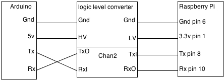

# Veículo de Tele-Presença

Este veículo de tele presença tem como objetivo de possibilitar uma pessoa se locomover e interagir virtualmente com outro ambiente via áudio e vídeo. O veículo utiliza o próprio navegador nativo da Raspbian para acessar um servidor de vídeo conferência público ou privado.

Se conecta a uma rede WiFi para acessar o servidor de vídeo conferência e receber os comandos para se locomover, funciona com bateria de 12V 7Ah de ácido chumbo.

## Materiais necessários:

- 1 - Display 7" 1024x600 touch
- 1 - Raspberry PI 4 B
- 1 - WebCam Logitech C920
- 1 - Caixa de som
- 1 - Bateria 12V 7Ah chumbo ácido
- 1 - Adaptador USB TP-Link WiFi com antena de 4dB, não foi utilizado o WiFi da própria Raspberry em função do baixo ganho de recepção.
- 1 - Carregador de baterias
- 1 - Conversor DC-DC
- 1 - Display O'Led I2C 128x64 
- 1 - Cartão Micro-SD 8GB Classe 10
- 1 - Teclado sem fio
- 1 - Joystick PS2 

- 1 - Conjunto de rodas Mecanum, comprado na China já com arduino e placa de controle que recebe via serial os comandos de movimentos, veja link: https://github.com/MoebiusTech/MecanumRobot-Arduino-Uno


## Passos para instalação:

Utilizado imagem - (2020-02-13-raspbian-buster) e gravar em um Micro-SD

Utizado um Adaptador USB WiFi com antena externa de 4dB, aumentado o ganho com relação a On-bord da Raspberry PI 4 B qual foi desativada e configurarada a externa como a seguir:

```
sudo apt-get update
sudo apt-get upgrade
/// Instala biblioteca de comunicação RS232
sudo pip install pyserial

sudo vi /boot/config.txt
dtoverlay=pi3-disable-wifi

sudo vi /etc/modprobe.d/raspi-blacklist.conf
#wifi
blacklist brcmfmac
blacklist brcmutil

sudo vi interfaces
source-directory /etc/network/interfaces.d
auto lo
iface lo inet loopback
iface eth0 inet manual
allow-hotplug wlan0
iface wlan0 inet manual
        wpa-conf /etc/wpa_supplicant/wpa_supplicant.conf

sudo raspi-config
Opção 5 - Interfacing Options / P2 SSH - Enable / P5 I2C - Enable / P6 Serial - Disable Shell and Enable Serial

/// Dando permissão ao usuário "pi" para acessar a serial built-in
sudo usermod -a -G dialout $(whoami)
sudo chmod ug+rw /dev/ttyS0
/// Para testes use a linha abaixo
minicom -b 9600 -o -D /dev/serial0
```

## telecontrol.py

Esta aplicação é pra ser executada na máquina que irá controlar o Veículo de tele-presença, recebe comandos do mouse clicando diretamente na tela da aplicação ou usando um controle PS2, como da foto acima, e envia para o Veículo via protocolo UDP.

Utiizando o Pyinstaller: 
```
pip install pywin32
pyinstaller --onefile --icon=control.ico telecontrol.py
```


## teleserver.py

Este já roda diretamente na Raspberry como serviço, primeiramente coloque o teleserver.py no /home/pi e veja procedimento abaixo para coloca-lo como serviço:

```
cd /etc/systemd/system
$sudo vi teleserver.service
[Unit]
Description=Recebe comandos UDP do client telecontrol.py
After=multi-user.target

[Service]
Type=simple
ExecStart=/usr/bin/python /home/pi/teleserver.py
Restart=always
# Linha abaixo determina 5 segundos para o serviço reiniciar novamente caso ele seja interrompido.
RestartSec=5s

[Install]
WantedBy=multi-user.target

$sudo chmod ugo+x teleserver.service
$sudo systemctl daemon-reload
$sudo systemctl enable teleserver.service
$sudo systemctl start teleserver
$sudo systemctl status teleserver
```
Mais detalhes sobre o systemd.service: https://www.freedesktop.org/software/systemd/man/systemd.service.html

## Instalado o driver do display O'Led

```
git clone https://github.com/adafruit/Adafruit_Python_SSD1306.git
cd Adafruit_Python_SSD1306
sudo python setup.py install
```


## Ligações do Display e da comunicação entre a Raspberry e o Arduino da base Mecanum

### Pinagem da Raspberry


### Conectividade RS232


### Conversor de nível, utilizado para compatibilizar o nível lógico da Raspberry Pi de 3.3V vs Arduino que utiliza 5V




### Display O'Led


Adicionar no arquivo /etc/rc.local a linha abaixo, para executar o /home/pi/monitor.py que é responsável para mostrar alguns dados no display.
```
sudo vi /etc/rc.local
sleep 10 && python /home/pi/monitor.py &
```
Obs.: Esta linha fica acima da última linha do arquivo /etc/rc.local que tem o comando "exit 0"

## Atualizando o DDNS

```

www.no-ip.com
telepresenca.zapto.org
https://www.noip.com/support/knowledgebase/install-ip-duc-onto-raspberry-pi/

mkdir /home/pi/noip
cd /home/pi/noip
wget https://www.noip.com/client/linux/noip-duc-linux.tar.gz
tar vzxf noip-duc-linux.tar.gz
cd noip-2.1.9-1  (ou versão atualizada)
sudo make
sudo make install


crontab -e
*/5 * * * * sudo noip2 -i `hostname -I | cut -d' ' -f1`

vi rc.local
noip2 -i `hostname -I | cut -d' ' -f1`

```

